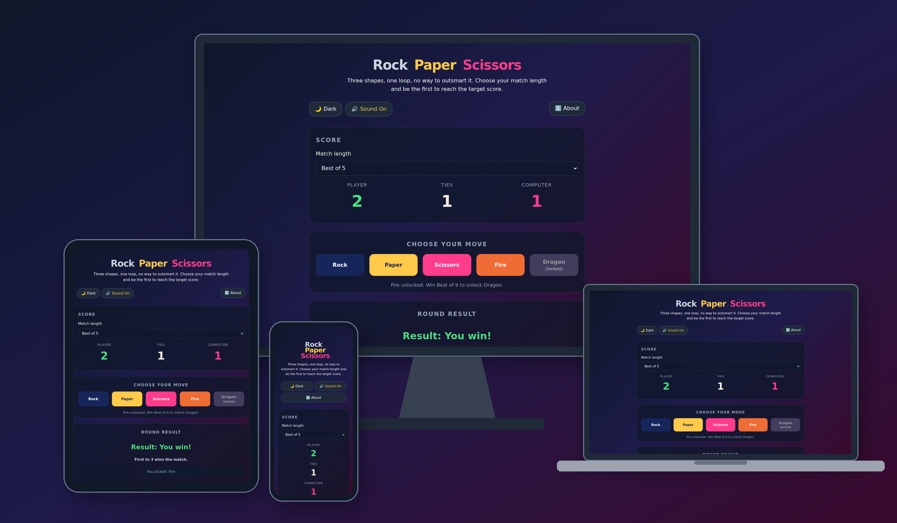
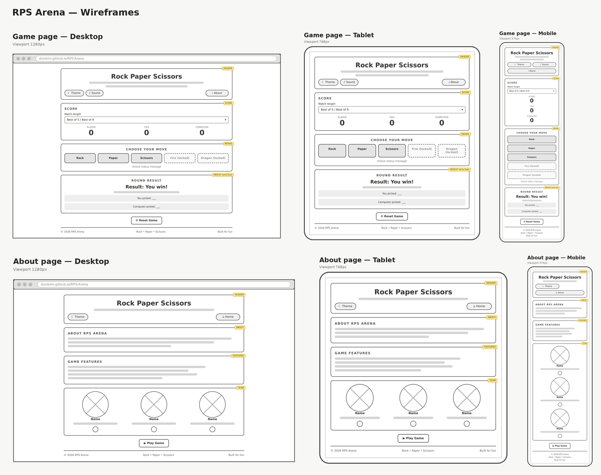
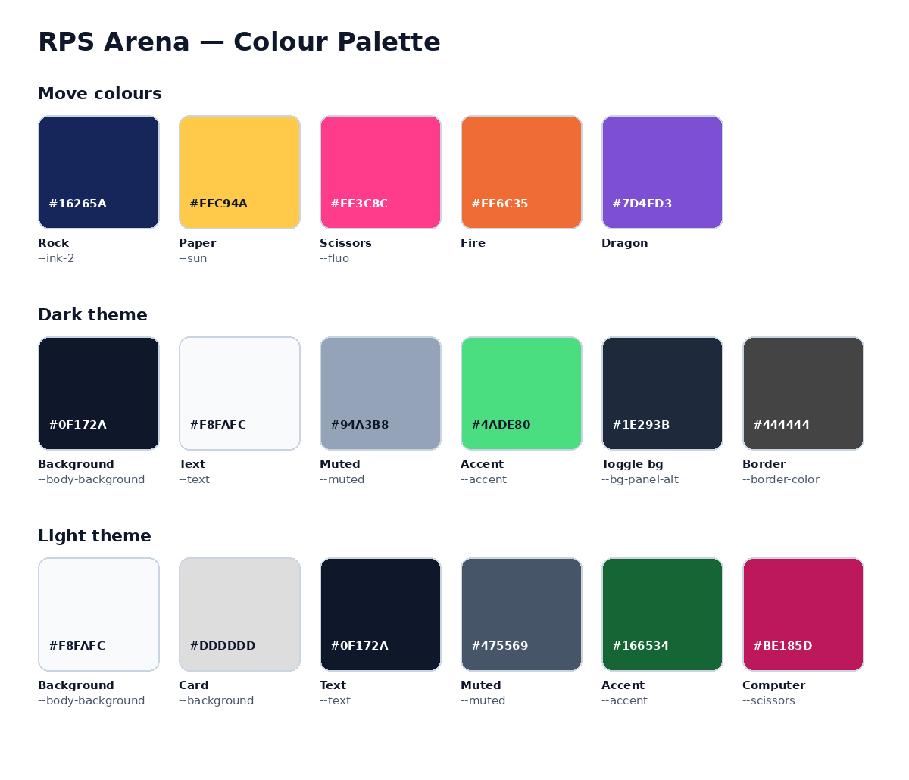
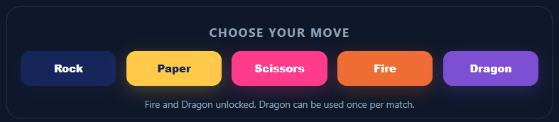
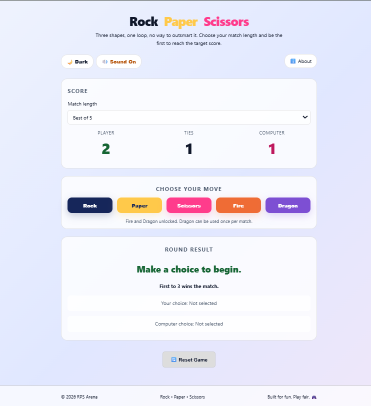
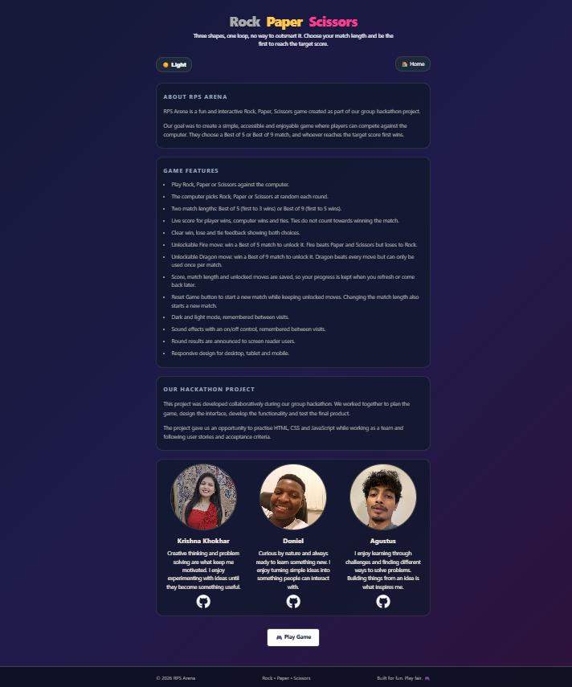
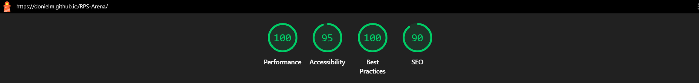
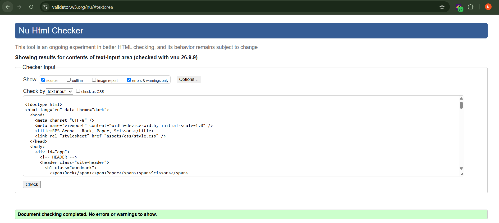
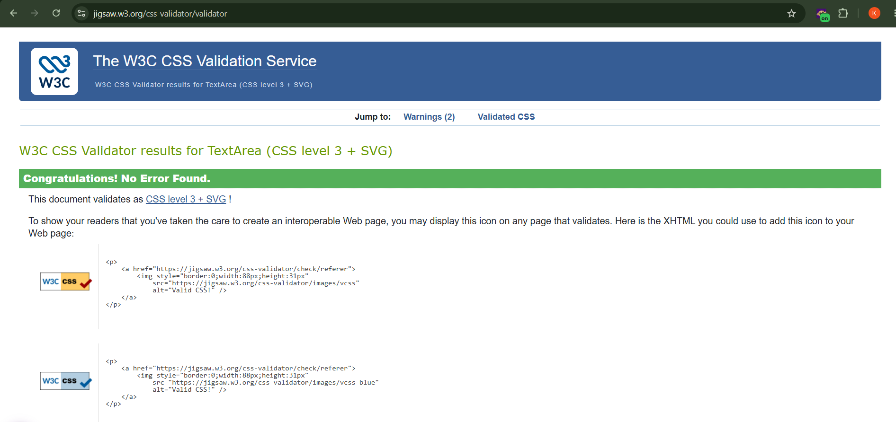

# RPS Arena — Rock, Paper, Scissors

A responsive and accessible Rock, Paper, Scissors game built as a group JavaScript hackathon project. Players choose a match length, play against the computer, and race to the target score, unlocking special **Fire** and **Dragon** moves along the way.



The live website can be found [here](https://github.com/DonielM/RPS-Arena).

The GitHub repository can be found [here](https://github.com/DonielM/RPS-Arena).

---

## Contents

- [Project Overview](#project-overview)
- [Project Criteria & Learning Outcomes](#project-criteria--learning-outcomes)
- [UX / Design](#ux--design)
  - [Project Goals](#project-goals)
  - [User Stories](#user-stories)
  - [Strategy](#strategy)
  - [Scope](#scope)
  - [Structure](#structure)
  - [Wireframes](#wireframes)
  - [Surface](#surface)
  - [Typography](#typography)
  - [Colour Scheme](#colour-scheme)
  - [Imagery](#imagery)
- [Game Rules](#game-rules)
- [Features](#features)
- [Future Features](#future-features)
- [Technologies Used](#technologies-used)
- [Testing](#testing)
  - [Google Lighthouse](#google-lighthouse)
  - [Browser Compatibility](#browser-compatibility)
  - [Responsiveness](#responsiveness)
  - [Code Validation](#code-validation)
  - [Manual Testing](#manual-testing)
  - [Accessibility Testing](#accessibility-testing)
  - [Bugs](#bugs)
- [Deployment](#deployment)
- [Running the Project Locally](#running-the-project-locally)
- [Team Collaboration](#team-collaboration)
- [AI Use and Reflection](#ai-use-and-reflection)
- [Credits](#credits)
- [Acknowledgements](#acknowledgements)

---

# Project Overview

The aim of this project is to create a fun, lightweight and accessible browser game that demonstrates front-end fundamentals: semantic HTML, custom CSS theming and vanilla JavaScript DOM manipulation and state management.

Rock, Paper, Scissors was chosen because the rules are universally understood, which allowed the team to focus on user experience, accessibility, persistence and extra game mechanics rather than explaining the game.

The project focuses on:

- Immediate playability with no instructions or login required.
- Clear feedback after every round and at the end of every match.
- Configurable match lengths (Best of 5 and Best of 9).
- Unlockable abilities that reward players for winning matches.
- Saving progress and preferences with `localStorage`.
- Dark and light themes and sound effects that can be switched on or off.
- A responsive layout across desktop, tablet and mobile.
- Accessible markup that works with keyboards and screen readers.

---

# Project Criteria & Learning Outcomes

The project was planned against the hackathon MVP criteria and learning outcomes:

| Learning Outcome                                                                                                                  | How RPS Arena addresses it                                                                                                            |
| --------------------------------------------------------------------------------------------------------------------------------- | ------------------------------------------------------------------------------------------------------------------------------------- |
| **LO1** – Design and implement an interactive front-end application focusing on UX, accessibility and responsive DOM manipulation | Game built with HTML, CSS and JavaScript; score, results and buttons update live through the DOM; responsive layout and ARIA support. |
| **LO2** – Test and validate the application                                                                                       | HTML/CSS validation, Lighthouse audits, manual user-story testing and browser testing (see [Testing](#testing)).                      |
| **LO3** – Deploy to a cloud platform                                                                                              | Deployed with GitHub Pages (see [Deployment](#deployment)).                                                                           |
| **LO4** – Maximise maintainability through documentation and code structure                                                       | This README, commented JavaScript, CSS custom properties and a clear `assets/` folder structure.                                      |
| **LO5** – Implement and document front-end interactivity with core JavaScript                                                     | Vanilla JS game logic, event listeners, `localStorage` persistence, unlockable abilities and sound control.                           |
| **LO6** – Leverage AI tools in the development process                                                                            | See [AI Use and Reflection](#ai-use-and-reflection).                                                                                  |

---

# UX / Design

## Project Goals

The main goals of the website are to:

- Let players start a game instantly with a single click.
- Show the result of each round clearly, including both players' choices.
- Let players control how long a match lasts.
- Reward winning with unlockable moves to encourage replay.
- Keep scores, settings and unlocks when the page is refreshed.
- Provide a comfortable experience in dark or light mode, with or without sound.
- Work well on any screen size and with assistive technology.
- Introduce the project and the team on an About page.

## User Stories

### As a player, I want to:

- Choose Rock, Paper or Scissors with a single click so I can play quickly.
- See the result of each round immediately so I know whether I won, lost or tied.
- See what both I and the computer picked.
- Choose a match length (Best of 5 or Best of 9) so I can control how long a game lasts.
- Know how many wins are needed to win the match.
- Unlock special moves by winning matches so I have a reason to keep playing.
- Keep my score, match length and unlocked moves if I refresh the page.
- Reset the game at any time to start a fresh match.
- Switch between dark and light mode so the site is comfortable to use.
- Turn sound effects on or off so I can play quietly if needed.
- Play comfortably on a phone, tablet or desktop.

### As a visitor, I want to:

- Understand the purpose of the site immediately.
- Read about the project and the team who built it.
- Find the team members' GitHub profiles.
- Navigate easily between the game and the About page.

## Strategy

**Purpose:** Deliver a lightweight, no-login browser game that is easy to pick up and demonstrates solid front-end fundamentals.

**Target audience:** Casual players looking for a quick game, and hackathon reviewers assessing the project.

**Research:** The team reviewed example JavaScript projects and previous hackathon projects shared on the project Miro board, as well as a list of suggested game features (scoreboards, unlockable achievements, theme switchers, sound controls, `localStorage` persistence).

## Scope

Features prioritised for the hackathon deadline:

- Player vs. computer gameplay.
- Live scoreboard (player wins, ties, computer wins).
- Selectable match length (Best of 5 / Best of 9).
- Round and match-end feedback.
- Unlockable Fire and Dragon moves.
- Persistent score, settings and unlocks.
- Dark/light theme toggle.
- Sound effects with an on/off toggle.
- Reset control.
- Responsive, accessible layout.
- About page with team information.

## Structure

| Page         | Purpose                                                                                       |
| ------------ | --------------------------------------------------------------------------------------------- |
| `index.html` | The game – theme/sound toggles, score and match length, move buttons, round result and reset. |
| `about.html` | Project overview, feature list, hackathon summary, team profiles and a "Play Game" button.    |

```
RPS-Arena/
├── index.html
├── about.html
├── README.md
└── assets/
    ├── css/
    │   └── style.css
    ├── js/
    │   ├── script.js     # game logic, sound, scores, unlocks
    │   └── theme.js      # dark/light mode (loaded on every page)
    ├── audio/            # sound effects
    └── images/           # team photos, README images
```

The game page is laid out as a series of cards, in this order:

1. Header – three-colour wordmark, short intro, theme and sound toggles, navigation.
2. Score – match length selector and the Player / Ties / Computer scoreboard.
3. Choose your move – Rock, Paper, Scissors, Fire and Dragon buttons, plus unlock status.
4. Round result – result, match status and both players' picks.
5. Reset – Reset Game button.
6. Footer.

## Wireframes

Wireframes were sketched before development to plan the score panel, move buttons and result area on mobile, tablet and desktop.

- **Desktop Wireframe:** [View Desktop Wireframe](assets/images/wireframe-desktop.png)
- **Tablet Wireframe:** [View Tablet Wireframe](assets/images/wireframe-tablet.png)
- **Mobile Wireframe:** [View Mobile Wireframe](assets/images/wireframe-mobile.png)



## Surface

The visual direction is a dark-first, high-contrast game interface with:

- A bold three-colour wordmark (Rock / Paper / Scissors).
- Pill-shaped navigation and toggle buttons.
- Card-style sections with rounded corners.
- A distinct colour for each move button so moves are easy to tell apart.
- Hover lift, press and focus effects on buttons.
- Greyed-out styling on locked, used or disabled buttons.
- A light theme alternative.

## Typography

A system font stack is used for fast loading and a native feel on every device – no web fonts need to be downloaded.

```css
--font-ui: system-ui, -apple-system, "Segoe UI", Roboto, sans-serif;
```

## Colour Scheme

Colours are defined as CSS custom properties. Theme colours switch based on the `data-theme` attribute on `<html>`.

| Variable              | Dark theme | Light theme | Use                              |
| --------------------- | ---------- | ----------- | -------------------------------- |
| `--body-background`   | `#0f172a`  | `#f8fafc`   | Page background                  |
| `--background`        | `#0f172a`  | `#dddddd`   | Card backgrounds                 |
| `--text`              | `#f8fafc`  | `#0f172a`   | Primary text                     |
| `--bone`              | `#f3eee2`  | `#0f172a`   | Body text                        |
| `--border-color`      | `#444`     | `#cccccc`   | Borders                          |
| `--footer-background` | `#151515`  | `#dddddd`   | Footer                           |
| `--ink-2`             | `#16265a`  | –           | Rock button                      |
| `--sun`               | `#ffc94a`  | –           | Paper button, wordmark accent    |
| `--fluo`              | `#ff3c8c`  | –           | Scissors button, wordmark accent |
| –                     | `#ef6c35`  | –           | Fire button                      |
| –                     | `#7d4fd3`  | –           | Dragon button                    |
| `--muted`             | `#94a3b8`  | `#475569`   | Headings, labels, secondary text |
| `--accent`            | `#4ade80`  | `#166534`   | Player score, round result       |
| `--scissors`          | `#ff3c8c`  | `#be185d`   | Computer score                   |
| `--bg-panel-alt`      | `#1e293b`  | `#ffffff`   | Toggle button backgrounds        |
| `--accent-secondary`  | `#ffc94a`  | `#b45309`   | Active toggle state              |
| `--border-hover`      | `#94a3b8`  | `#64748b`   | Reset button hover               |



## Imagery

- Team photos on the About page, shown as circular portraits.
- Font Awesome GitHub icons linking to each team member's profile.
- Emoji used as lightweight, dependency-free icons (🌙 🔊 🔇 🔄 🎮 🏠 ℹ️).

---

# Game Rules

Standard rules apply every round:

| Move        | Beats                           | Availability                                                   |
| ----------- | ------------------------------- | -------------------------------------------------------------- |
| 🪨 Rock     | Scissors                        | Always                                                         |
| 📄 Paper    | Rock                            | Always                                                         |
| ✂️ Scissors | Paper                           | Always                                                         |
| 🔥 Fire     | Paper, Scissors (loses to Rock) | Unlocked by winning a **Best of 5** match                      |
| 🐉 Dragon   | Rock, Paper, Scissors           | Unlocked by winning a **Best of 9** match – **once per match** |

- Matching picks are a **tie**. Ties are counted but do not count towards winning the match.
- The computer only ever picks Rock, Paper or Scissors, at random.

| Mode      | Target              |
| --------- | ------------------- |
| Best of 5 | First to **3** wins |
| Best of 9 | First to **5** wins |

---

# Features

## Header & Navigation

- Three-colour Rock / Paper / Scissors wordmark and a short introduction.
- Theme toggle and sound toggle buttons.
- Navigation link between the game (Home) and the About page.
- On small screens, navigation and toggles stack vertically.


## Scoreboard & Match Length

- Live score for Player, Ties and Computer.
- A **Match length** dropdown to choose Best of 5 or Best of 9.
- The chosen match length is saved (`rps-match-target`) and restored on reload.
- Changing the match length starts a new match.


## Move Buttons

- Large, colour-coded buttons for Rock, Paper, Scissors, Fire and Dragon.
- Fire and Dragon show **(locked)** until unlocked, and Dragon shows **(used)** once it has been played in the current match.
- A status message explains how to unlock the abilities and which ones are unlocked.
- All move buttons are disabled when a match ends.



## Unlockable Abilities

- Winning a Best of 5 match permanently unlocks **Fire**.
- Winning a Best of 9 match permanently unlocks **Dragon**.
- Unlocks are saved separately from the score (`rps-unlocked-abilities`), so they survive resets and page reloads.

## Round Result

- Shows the round result (win, lose or tie), the match status and what both players picked.
- When a player reaches the target, a match-end message is shown ("You win the match!" / "Computer wins the match!").
- The result area uses `aria-live="polite"` so screen readers announce each result.


## Saved Progress

The following are stored in `localStorage`:

| Key                           | Stores                                            |
| ----------------------------- | ------------------------------------------------- |
| `score`                       | Player wins, computer wins and ties               |
| `rps-match-target`            | Selected match length (3 or 5)                    |
| `rps-dragon-used`             | Whether Dragon has been used in the current match |
| `rps-unlocked-abilities`      | Whether Fire and Dragon are unlocked              |
| `rps-sound`                   | Sound on/off preference                           |
| Theme key (set in `Theme.js`) | Dark/light preference                             |

## Sound Effects

- Different sounds for a round win, round loss, tie and match end.
- A **Sound On / Sound Off** button with an `aria-label` that updates ("Mute sound effects" / "Enable sound effects").
- The preference is saved between visits.

## Dark / Light Mode

- Toggle between dark and light themes, handled by `Theme.js` on every page.
- The preference is remembered between visits.



## Reset Game

- Clears the score, result text and picks, and re-enables the move buttons.
- Resets Dragon's once-per-match use, while keeping unlocked abilities.

## About Page

- Overview of the project and its goals.
- Full list of game features.
- Summary of the hackathon project.
- Team profiles with photos, short bios and GitHub links.
- A **Play Game** button to return to the game.



## Footer

- Displayed on every page with copyright and project information.
- Stacks vertically on small screens.

---

# Future Features

- Player vs. player mode (local or online).
- Win-streak tracking and a persistent leaderboard.
- Player name entry and a personalised welcome message.
- Animated move reveals or a countdown before each round.
- Keyboard shortcuts for choosing a move.
- A harder computer opponent that can also use abilities.
- A custom 404 page.
- Offline support / installable PWA.

---

# Technologies Used

## Languages

- **HTML5** – page structure and semantic markup.
- **CSS3** – styling, custom properties, Flexbox, Grid and media queries.
- **JavaScript (ES6+)** – game logic, DOM manipulation, sound and `localStorage`. No framework.

## Libraries

- **Font Awesome** – GitHub icons on the About page (loaded via CDN kit).

## Programs & Tools

- **Git** – version control.
- **GitHub** – repository hosting and collaboration.
- **GitHub Pages** – deployment.
- **Visual Studio Code** – development environment.
- **Miro** – project planning, user stories, design and README planning.
- **Chrome DevTools** – debugging and responsive testing.
- **Google Lighthouse** – performance, accessibility, best practice and SEO audits.
- **W3C HTML Validator** – HTML validation.
- **W3C CSS (Jigsaw) Validator** – CSS validation.
- **JSHint** – JavaScript validation.
- **AI tools** – coding support, debugging and documentation (see [AI Use and Reflection](#ai-use-and-reflection)).

---

# Testing

Testing was carried out throughout development to make sure the game works correctly across devices and browsers.

Testing included:

- HTML, CSS and JavaScript validation.
- Lighthouse testing.
- Browser compatibility testing.
- Responsive testing.
- Manual user-story testing.
- Accessibility checks.

## Google Lighthouse

Google Lighthouse was used to check both pages for Performance, Accessibility, Best Practices and SEO.

| Page         | Performance | Accessibility | Best Practices | SEO         |
| ------------ | ----------- | ------------- | -------------- | ----------- |
| `index.html` | _add score_ | _add score_   | _add score_    | _add score_ |
| `about.html` | _add score_ | _add score_   | _add score_    | _add score_ |



## Browser Compatibility

| Browser         | Result        |
| --------------- | ------------- |
| Google Chrome   | _Pass / Fail_ |
| Microsoft Edge  | _Pass / Fail_ |
| Mozilla Firefox | _Pass / Fail_ |
| Safari          | _Pass / Fail_ |

Areas checked: layout, navigation, move buttons, scoring, sound, theme toggle, saved progress and responsive behaviour.

## Responsiveness

The site was tested with Chrome DevTools at desktop, laptop, tablet and mobile widths.

- **Above 650px** – move buttons sit in a five-column row, navigation and toggles sit side by side.
- **650px and below** – navigation stacks vertically, move buttons become a single full-width column, the wordmark stacks and shrinks, and the footer stacks.
- **400px and below** – the scoreboard becomes a single column and the result text shrinks further.

Particular attention was given to text size, button size, spacing and avoiding horizontal scrolling.

## Code Validation

### HTML Validation

Both pages were checked with the [W3C HTML Validator](https://validator.w3.org/).

| File         | Result        |
| ------------ | ------------- |
| `index.html` | _Pass / Fail_ |
| `about.html` | _Pass / Fail_ |



### CSS Validation

`style.css` was checked with the [W3C CSS Validator](https://jigsaw.w3.org/css-validator/).



### JavaScript Validation

`Script.js` and `Theme.js` were checked with [JSHint](https://jshint.com/) (with ES6+ enabled).


## Manual Testing

| User Story                                           | Test                                                                                                                         | Result        |
| ---------------------------------------------------- | ---------------------------------------------------------------------------------------------------------------------------- | ------------- |
| As a player, I want to pick a move with one click.   | Click Rock, Paper and Scissors and confirm a round is played each time.                                                      | _Pass / Fail_ |
| As a player, I want to see each round's result.      | Play several rounds and confirm the result, your pick and the computer's pick are shown correctly for wins, losses and ties. | _Pass / Fail_ |
| As a player, I want an accurate score.               | Confirm the Player, Ties and Computer counts increase correctly.                                                             | _Pass / Fail_ |
| As a player, I want to choose a match length.        | Select Best of 5 and Best of 9 and confirm the target (3 or 5) is shown and the score resets.                                | _Pass / Fail_ |
| As a player, I want the match to end at the target.  | Reach the target and confirm the match-end message appears and all move buttons are disabled.                                | _Pass / Fail_ |
| As a player, I want ties not to end the match.       | Confirm ties do not count towards the target.                                                                                | _Pass / Fail_ |
| As a player, I want to unlock Fire.                  | Win a Best of 5 match and confirm Fire unlocks and beats Paper and Scissors but loses to Rock.                               | _Pass / Fail_ |
| As a player, I want to unlock Dragon.                | Win a Best of 9 match and confirm Dragon unlocks, wins its round and shows "(used)" afterwards.                              | _Pass / Fail_ |
| As a player, I want my progress saved.               | Refresh the page and confirm the score, match length and unlocks are kept.                                                   | _Pass / Fail_ |
| As a player, I want to reset the game.               | Click Reset Game and confirm the score and result text clear, buttons re-enable and unlocks are kept.                        | _Pass / Fail_ |
| As a player, I want dark and light mode.             | Toggle the theme, refresh, and confirm the theme is kept on both pages.                                                      | _Pass / Fail_ |
| As a player, I want to control sound.                | Toggle sound off, play a round (no sound), refresh, and confirm the setting is kept.                                         | _Pass / Fail_ |
| As a mobile user, I want the game to be easy to use. | Test at mobile widths and check layout, buttons and readability.                                                             | _Pass / Fail_ |
| As a visitor, I want to learn about the team.        | Open the About page and confirm photos, bios and GitHub links work (opening in a new tab).                                   | _Pass / Fail_ |
| As a visitor, I want to navigate easily.             | Test the About, Home and Play Game links.                                                                                    | _Pass / Fail_ |

## Accessibility Testing

Accessibility was considered throughout development. The following were checked:

- Semantic landmarks (`<header>`, `<main>`, `<nav>`, `<footer>`) and a logical heading structure.
- `aria-labelledby` on game sections, linking each to its heading.
- `aria-live="polite"` on the round result so screen readers announce results.
- `aria-label` on the sound toggle that updates with its state.
- `aria-pressed` on the toggle buttons.
- A labelled `<select>` for match length.
- Native `<button>` and `<a>` elements for all controls, keeping keyboard access and tab order.
- Visible `:focus-visible` outlines.
- Disabled buttons that are both visually greyed out and actually disabled.
- Alt text on team photos.
- Colour contrast in both themes.
- Keyboard-only play and screen reader testing.

## Bugs

### Fixed Bugs

| Bug                                                                                                                         | Fix                                                                                                                                                                       |
| --------------------------------------------------------------------------------------------------------------------------- | ------------------------------------------------------------------------------------------------------------------------------------------------------------------------- |
| The match-win sound (`match-win.mp3`) played at the end of every match, including when the computer won.                    | The sound now only plays when the player wins the match (`if (playerWon)`); when the computer wins, the round's lose sound is heard instead.                              |
| Dragon's once-per-match "used" state was only held in memory, so refreshing the page mid-match made Dragon available again. | The state is now saved to `localStorage` (`rps-dragon-used`) when Dragon is played, loaded on page start, and cleared when the game is reset or the match length changes. |

---

# Deployment

## Creating the Repository

1. Sign in to GitHub.
2. Create a new repository and give it a suitable name.
3. Add team members as collaborators.
4. Clone the repository into the development environment.
5. Add the project files.
6. Commit changes regularly with clear messages.
7. Push changes to GitHub.

## Deploying to GitHub Pages

1. Open the repository on GitHub.
2. Select **Settings**.
3. Select **Pages** from the sidebar.
4. Under **Build and deployment**, set **Source** to **Deploy from a branch**.
5. Select the **main** branch and the **/ (root)** folder.
6. Click **Save**.
7. Wait for GitHub Pages to publish the site; the URL appears at the top of the Pages settings.
8. Open the live site and check that the game, sound, themes, images and links all work as they did locally.

## Live Website

https://DonielM.github.io/RPS-Arena/

## GitHub Repository

https://github.com/DonielM/RPS-Arena

---

# Running the Project Locally

No build tools or dependencies are needed.

1. Clone the repository:
   ```bash
   git clone https://github.com/DonielM/RPS-Arena.git
   cd RPS-Arena
   ```
2. Open `index.html` in a browser, **or** use VS Code's Live Server extension, **or** run:
   ```bash
   python3 -m http.server
   ```
   and visit `http://localhost:8000`.

---

# Team Collaboration

The project was planned and managed as a team using:

- **Miro** – a shared board for project criteria, user stories, design, wireframes and README planning.
- **Google Slides** – a shared project board for collaboration.
- **GitHub** – shared repository and version control.
- **Presentation template** – used to prepare the final hackathon presentation.

The team followed the planning steps from the hackathon board:

1. **Idea & user stories** – define the purpose, audience and user stories.
2. **Design** – choose colours, typography and button styles with accessibility in mind.
3. **Wireframes** – sketch mobile, tablet and desktop layouts.
4. **Documentation** – write this README covering features, technologies, testing and deployment.

---

# AI Use and Reflection

AI tools were used to support the development process, not to replace testing or decision-making. All suggestions were reviewed, adapted and tested before being added to the project.

## AI-Assisted Code Creation

AI was used to suggest HTML, CSS and JavaScript approaches, such as the structure for the unlockable abilities, the `beats()` lookup object and saving data with `localStorage`. Generated code was adapted to fit the project's structure and style.

## AI-Assisted Debugging

AI helped investigate issues such as:

- Buttons not disabling correctly at the end of a match.
- Saved values not loading correctly on refresh.
- Layout problems at smaller screen sizes.
- Theme and sound settings not persisting.

Suggested fixes were tested manually before being accepted.

## AI-Assisted UX, Accessibility and Documentation

AI suggestions were considered for accessibility (ARIA attributes and live regions), responsive design, code comments and structuring this README.

## Reflection

AI made parts of the process faster, especially debugging and exploring different ways to implement features. However, it did not always produce correct or project-appropriate code, which reinforced the importance of reviewing, testing and validating every suggestion rather than trusting it automatically.

---

# Credits

## Content

- All game text and About page content was written by the team.
- Project planning resources and criteria were provided on the hackathon Miro board.

## Code

- [MDN Web Docs](https://developer.mozilla.org/) – reference for `localStorage`, the `Audio` API, `aria-live` and optional chaining.

## Media

- **Icons:** [Font Awesome](https://fontawesome.com/)
- **Team photos:** supplied by each team member.
- **Sound effects:** [Mixkit](https://mixkit.co/free-sound-effects/), used under the Mixkit free sound-effect licence. Stored in `assets/audio/`:

| File               | Sound                               | Mixkit Category     |
| ------------------ | ----------------------------------- | ------------------- |
| `player-win.mp3`   | "Quick win video game notification" | Game/Win Sounds     |
| `computer-win.mp3` | "Wrong answer fail notification"    | Game/Lose Sounds    |
| `draw.mp3`         | "Confirmation tone"                 | Notification Sounds |
| `match-win.mp3`    | "Game level completed"              | Game Sounds         |
| `match-lose.mp3`   | "_Mixkit sound name_"               | _Mixkit category_   |

## Team

| Name                | GitHub                                        |
| ------------------- | --------------------------------------------- |
| **Krishna Khokhar** | [Krishna2414](https://github.com/Krishna2414) |
| **Doniel**          | [DonielM](https://github.com/DonielM)         |
| **Agustus**         | [Agustus](https://github.com/Agustus)         |

---

# Acknowledgements

We would like to acknowledge:

- **Code Institute** and the hackathon organisers and mentors for the course material, guidance and feedback.
- **GitHub** for repository hosting and GitHub Pages deployment.
- **Mixkit** and **Font Awesome** for free resources.
- The developers of the open-source tools and documentation used in this project.

---

_Built for fun. Play fair. 🎮_
